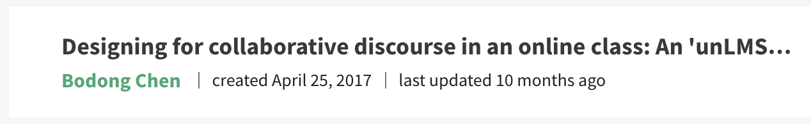
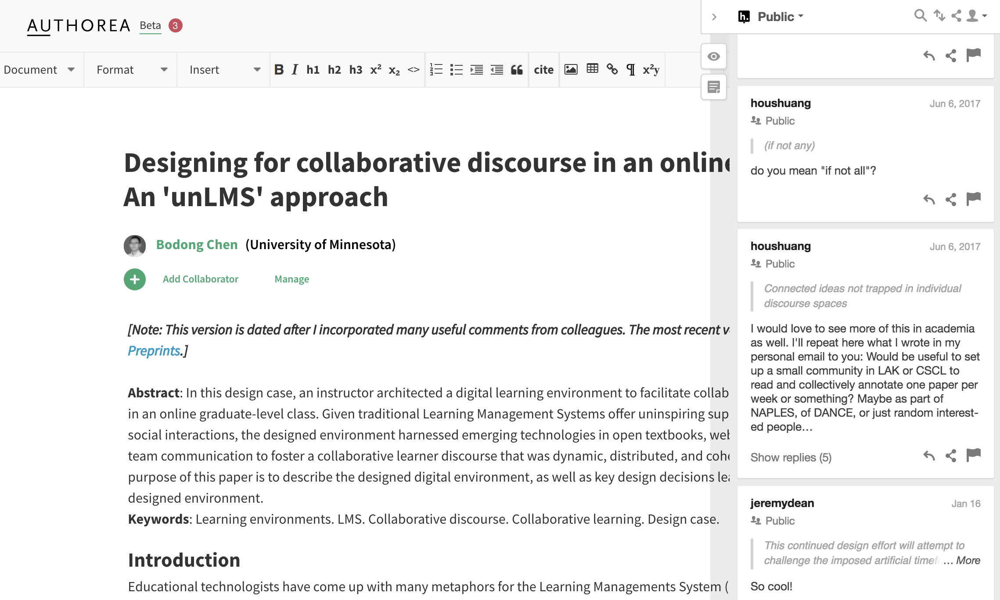
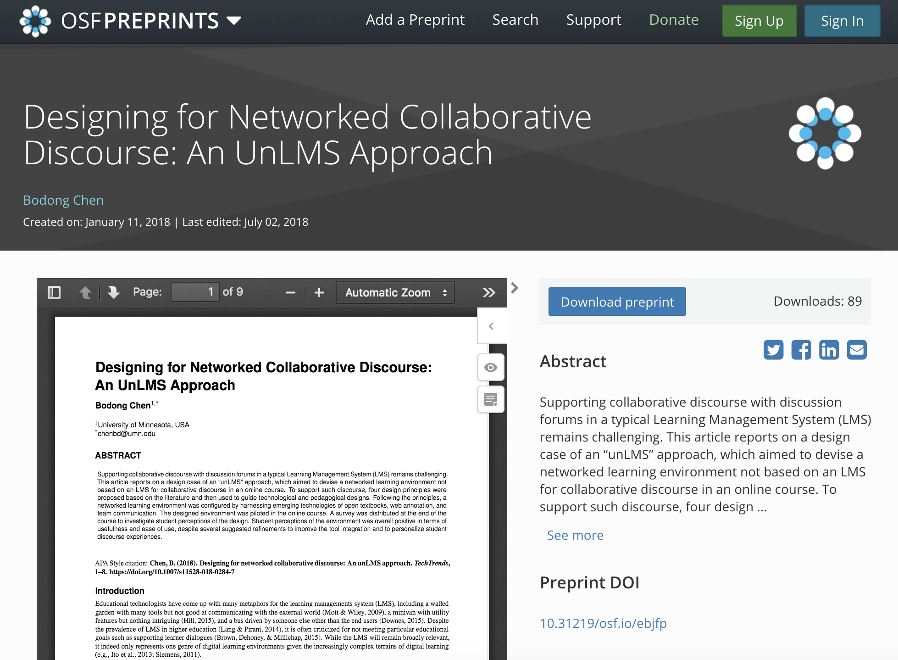

+++
title = "#OAWeek 2018: My Personal Journey"
date = 2018-10-26T19:48:18-05:00
draft = false

# Tags and categories
# For example, use `tags = []` for no tags, or the form `tags = ["A Tag", "Another Tag"]` for one or more tags.
tags = []
categories = []

# Featured image
# To use, add an image named `featured.jpg/png` to your page's folder. 
[image]
  # Caption (optional)
  caption = "Credit: openaccessweek.org"

  # Focal point (optional)
  # Options: Smart, Center, TopLeft, Top, TopRight, Left, Right, BottomLeft, Bottom, BottomRight
  focal_point = "Top"
+++

This week is the [**Open Access Week 2018**](http://www.openaccessweek.org/). Yesterday we spent some time during a student advising meeting talking about the *what* and *why* of Open Access.

The Open Access Week website has provided [a great list of ideas for researchers to get involved in Open Access](http://www.openaccessweek.org/profiles/blogs/researchers-ideas). My own institution does have an [Open Access policy](https://policy.umn.edu/research/scholarlyarticles). [Our univeristy library system](https://www.lib.umn.edu/openaccess) also provides support for Open Access including [an Open Access Publishing Fund](https://www.lib.umn.edu/openaccess/open-access-publishing-fund), [a Digital Conservancy system](https://conservancy.umn.edu/), [a Research Data Repository](https://conservancy.umn.edu/handle/11299/166578), etc. Not to mention my college is spearheading the [Open Textbook Library](https://research.cehd.umn.edu/otn/).

In this post, I am writing up a few vignettes based on my humble journey with Open Access.

## Being Aware

In 2009, I became aware of Open Access during a talk at Beijing Normal (probably given by [Stian Haklev](https://twitter.com/houshuang)). At that time, he was finishing up his master's thesis on "top-quality open courses in China," and [P2PU](https://p2pu.org/) he co-founded was still an emerging thing. 

<blockquote class="twitter-tweet" data-lang="en">
Open access, Open license, &quot;Free Speech/Beer&quot;, Peer production, Yochai Benkler, P2PU, CMU OLI, Stephen Downes, SLL... (May 31th in BNU)
&mdash; ʙᴏᴅᴏɴɢ ᴄʜᴇɴ (@bod0ng) <a href="https://twitter.com/bod0ng/status/1981115328?ref_src=twsrc%5Etfw">May 31, 2009</a></blockquote>

In 2010, I participated in an Open Access Week event at OISE of the University of Toronto. [Leslie Chan](https://www.utsc.utoronto.ca/acm/leslie-chan), a professor from University of Toronto at Scarborough, and Stian were running a panel in the OISE library. I don't remember what they were presenting but I'm quite sure their arguments were so eloquent that I became invested in Open Access on that day.

## Sharing Drafts, Posting Preprints

Yesterday, I participated in a fun discussion with colleagues from the [Office of Innovation](https://ai.umich.edu/) at the University of Michigan about my paper about ["unLMS"](/publication/chen2018-tw/). Interestingly, this paper has yet to be included in a formal, printed issue of the journal *TechTrends*.

<blockquote class="twitter-tweet" data-lang="en">
Great turnout for brown bag lunch with guest  <a href="https://twitter.com/bod0ng?ref_src=twsrc%5Etfw">@bod0ng</a> on networked collaborative discourse <a href="https://twitter.com/UMichiganAI?ref_src=twsrc%5Etfw">@UMichiganAI</a> <a href="https://twitter.com/rebquintana?ref_src=twsrc%5Etfw">@rebquintana</a> <a href="https://t.co/fwe2thdsJE">pic.twitter.com/fwe2thdsJE</a>
&mdash; Nobuko Fujita (@nobukofujita) <a href="https://twitter.com/nobukofujita/status/1055855364405526528?ref_src=twsrc%5Etfw">October 26, 2018</a></blockquote>

Here is the timeline of this particular piece of work:

**In April 2017**, I started an open manuscript on [Authorea](https://www.authorea.com/users/4746/articles/169983-designing-for-collaborative-discourse-in-an-online-class-an-unlms-approach).

**In June 2017**, before submitting this paper to *TechTrends*, I openly invitated colleagues on Twitter to comment on this manscripts. I received a bunch of comments from Stian, which I incorporated into the submitted version.

**In Jan 2018**, I uploaded [a *preprint* on the Open Science Framework](https://osf.io/ebjfp/). [Jeremy Dean](https://twitter.com/dr_jdean) from Hypothes.is chimed in on Authorea later in Jan 2018 and we eventually met in June 2018 at the [I Annotate](http://iannotate.org) conference in San Francisco.

**On April 22, 2018**, after going through two rounds of revisions (with great comments from reviewers and the editor), the article was publised "Online First" in *TechTrends*. 

Till now, **October 2018**, this article is still in its "Online First" status and may get included in an issue next year. However:

- its first version on Authorea has been annotated 24 times
- its OSF preprint has been downloaded 89 times
- its Springer "Online First" version has been downloaded 89 times, shared 14 times, and annotated 43 times

**From its inception in 2017 to its "formal" appearance in a printed issue in 2019, a whole lot has happened to this particular work.** Indeed, I've spent extra hours to make things work (e.g., converting between document formats, uploading to OSF). But this journey, which I did not anticipate in the beginning, has been extremely rewarding. This article may not be my seminal work, but **it is reassuring that by doing bits and pieces related to Open Access, we as researchers can (1) receive feedback from a broader audience, (2) make valuable connections with colleagues, and (3) get our work read and discussed -- much earlier than its formal publication**.

## Voicing the Stance

Despite the power of Open Access -- and more broadly, [Open Scholarship](/notes) -- I've experienced so far, **it is unfortunate some disciplines and some tenure committees (*not mine*) would bluntly equate Open Access with "lesser quality."** The [tyranny of metrics](http://blogs.sciencemag.org/books/2018/01/30/the-tyranny-of-metrics/) is worth a separate post. But here I want to share a statement related to Open Access I decided to include in my dossier (as a tenure-track professor): 

> As an interdisciplinary scholar, I seek to publish in refereed journals from various fields of research, including learning sciences, educational technology, educational psychology, and learning analytics.  
>
> As an advocate of Open Scholarship, I also attempt to balance my publication venues between “traditional” journals and quality open-access alternatives. 
> 
> As a scholar with Chinese heritage, I also write for audiences who speak my mother tongue.

Despite 10 years of #OpenAccessWeek, we still have a long way to go to make **"Invisible Labour"** in Open Scholarship visible and valued. This is a sudden realization I had this year, thanks to the tweet below.

<blockquote class="twitter-tweet" data-cards="hidden" data-lang="en">
<a href="https://twitter.com/hashtag/OAweek?src=hash&amp;ref_src=twsrc%5Etfw">#OAweek</a> event in Vancouver BC Canada: Open but not free: Invisible Labour in Open Scholarship. <a href="https://t.co/aNz8txzD1c">pic.twitter.com/aNz8txzD1c</a>
&mdash; Christina Hendricks (@clhendricksbc) <a href="https://twitter.com/clhendricksbc/status/1055265533765926912?ref_src=twsrc%5Etfw">October 25, 2018</a></blockquote>

While I will continue to do those "bits and pieces," I will especially try to be a strong adavocate for: (1) valuing work published in many quality open-access journals, and (2) crediting labor put into Open Scholarship -- including [Open Access, Open Education, and Open Data](https://sparcopen.org/why-open-matters/) (according to SPARC) -- in tenure or performance review committees. 

More broadly, we need [**changes with institutional culture**](http://www.irrodl.org/index.php/irrodl/article/view/2523/3877), **re-imagined writing and publishing practices** (like [PubPub](https://www.pubpub.org)), and **better Open Scholarship infrastructure** (like [the Open Science Framework](https://osf.io/), [ICPSR](https://www.icpsr.umich.edu/icpsrweb/), and [Open Web Annotation](/post/2018-07-public-scholarly-annotation)). 

I wonder how things may look like in 2028!
