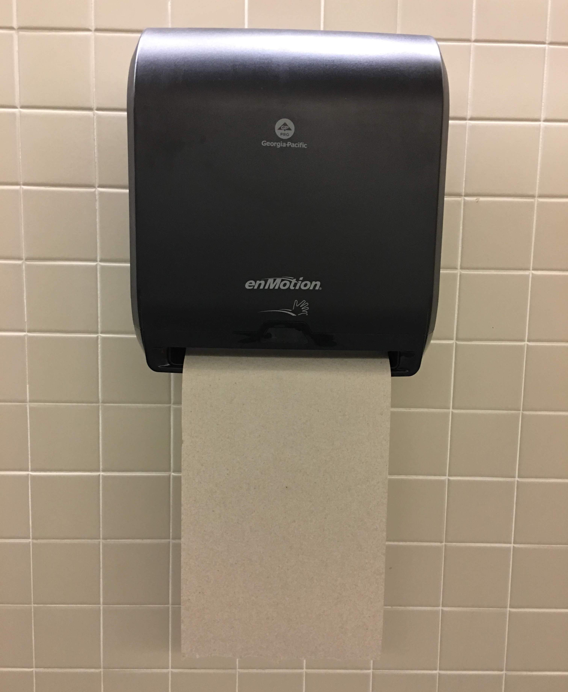
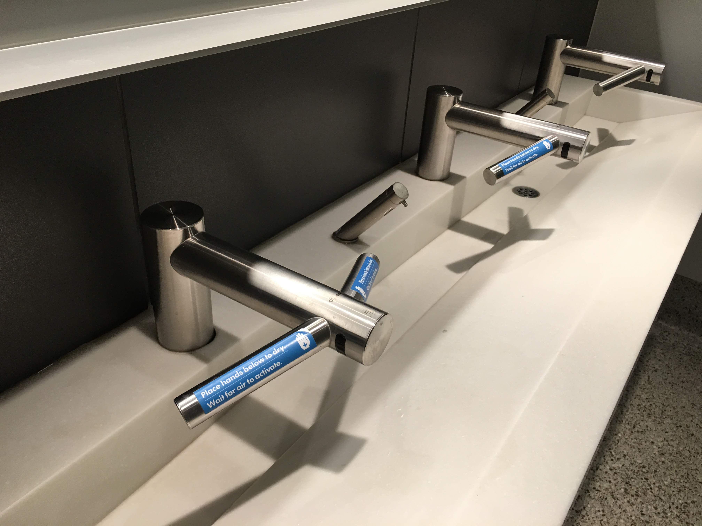

+++
title = "Automate for Whom?"
date = 2019-03-14T13:57:08-05:00
draft = false

# Tags and categories
# For example, use `tags = []` for no tags, or the form `tags = ["A Tag", "Another Tag"]` for one or more tags.
tags = ["AI", "Automation", "Value"]
categories = ["blog"]

# Featured image
# To use, add an image named `featured.jpg/png` to your page's folder. 
[image]
  # Caption (optional)
  caption = "[Photo credit: Pixabay](https://pixabay.com/illustrations/robot-robotics-technology-software-2027195/)"

  # Focal point (optional)
  # Options: Smart, Center, TopLeft, Top, TopRight, Left, Right, BottomLeft, Bottom, BottomRight
  focal_point = ""
+++

I have been working at a large public R1 university long enough -- 4 years -- to witness steady changes with technology installed in public restrooms. 

Below is a newly installed automatic paper towel dispenser in our office building. As someone who tends to use 1 paper towel, I was very frustrated by the design that doesn't keep me -- a user -- in the loop and forces me to use that much paper.

Below is a picture of a fancy hand wash station I saw during last week's conference travel. It neatly integrates a soap dispenser, a water tap, and a hand dryer together. There are at least three sensors built in this integrated system. It's probably based on a zero-paper consumption philosophy, and has fundamentally transformed one's hand-washing process. 

I started to wonder: **Whom does automation -- and an integrated automation system -- serve? Whom did the designers have in mind when designing these products?**  And finally, **what lessons we can learn as designers of learning systems** (or using a new fancy title, as **learning engineers**)?
