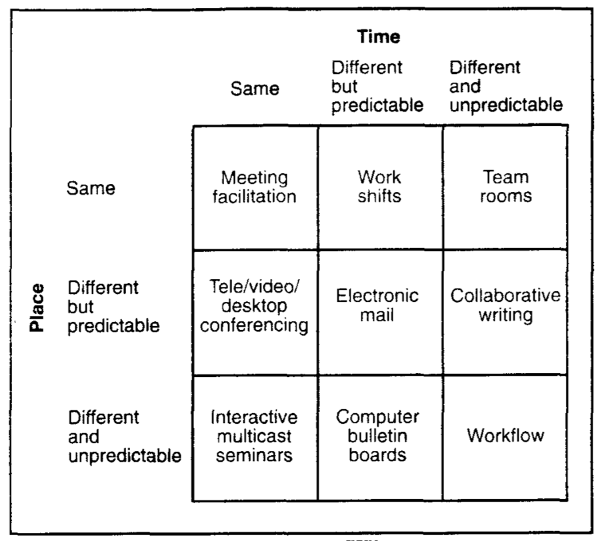
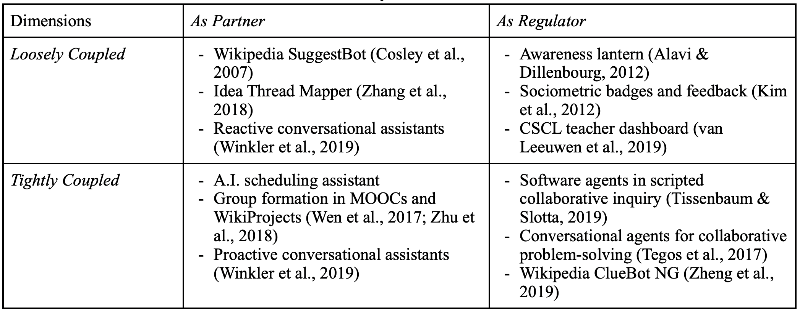

In a chapter to be included in the 2nd edition of the *Handbook of Learning Analytis*, Dr. Stephanie Teasley and I tried to write about **Collaboration Analytics** in a way that integrate ideas from CSCL, CSCW, learning sciences, and learning analytics. Below is a draft abstract of the chapter. In this post, I am sharing a key message from this chapter -- **a map of collaboration analytics** -- and invite you to provide me feedback and suggestions.

> *Abstract*: Collaboration is an important competency in the modern society. To harness the intersection of learning, work, collaboration, and analytics, several fundamental challenges need to be addressed. This chapter about collaboration analytics aims to mitigate these challenges for the learning analytics community. We first survey the conceptual landscape of collaboration and learning with a focus on the CSCL literature while attending to perspectives from CSCW and HCI. Grounded in the conceptual exploration, we then distinguish two salient strands of collaboration analytics: (a) *computational analysis of collaboration* that involves the application of computational methods to examining collaborative processes; and (b) *analytics for collaboration* which is primarily concerned with designing and deploying data analytics in authentic contexts to facilitate collaboration. Examples and cases representing contexts of different scale, space, and analytical frames are presented, followed by a discussion of key challenges and future directions.

## The matrices of groupware systems

In CSCW (Computer Supported Cooperative Work), researchers have developed a number of ways to classify groupware systems that support cooperative/collaborative[^1] work. 

[^1]: Collaboration and cooperation are used interchangeably in general discourse and in fields such as CSCW and HCI; for them collaboration broadly means teamwork and cooperative work in a group.

One representative example is classifying groupware by *where* and *when* the participants are performing the cooperative work (see the figure below from [Grudin, 1994](http://ieeexplore.ieee.org/document/291294/)). A time/space matrix is used to summarize the classification. The time/space matrix is a very useful reference when discussing a particular cooperative work context and design constraints it entails. 

## A map of collaboration analytics

When thinking about analytics for collaboration -- collaborative learning or work -- we think the community could benefit from such a classification system. Here, we locate the central concern of *analytics* at the translation/transformation of findings from *analysis* to *actions* in the learning analytics cycle. While the analysis of collaboration is dictated by epistemological and conceptual ideas (which are expanded in the chapter but not this post), **the use of analytics for collaboration deals with the distribution of agency between human and computer, as well as a wide range of other design decisions.** So the map of collaboration analytics we derive is based on how collaboration analytics are deployed in socio-technical systems of collaboration to make an impact. 

As illustrated in the table below, **we discuss collaboration analytics along two important dimensions: (1) analytics as partner vs. regulartor, and (2) analytic actions being closely vs. loosely coupled with collaboration.** While there are other dimensions to consider, such as by the consumer of analytic information and the level of analytic focus, we choose to articulate these two dimensions as they are central to human-computer partnership that CSCL and CSCW care about since their inceptions. 

### Dimension 1: Analytics as Partner vs. Regulator of Collaboration

The first dimension is concerned with the power distribution between analytics and humans (e.g., learners, teachers). Along this dimension, we distinguish analytics as a *regulator* versus a *partner* of collaborative interaction.

When analytics functions as a *partner* of collaboration, it acts to facilitate collaboration but still turns to humans for action-taking. For instance, analytics applications are designed to support time coordination, a surprisingly challenging task for today’s organizations, teams, and families. Time coordination is a hard problem not only because of the geographical and temporal distribution of team members, but also explicit and implicit temporal structures not commonly understood by team members (Wu et al., 2016). Coordinating schedules among co-workers could still be a frustrating task despite coordination systems such as shared calendars. To confront this challenge, HCI and CSCW researchers have created A.I. scheduling assistants that act just like human agents to schedule meetings (Cranshaw et al., 2017; Modi et al., 2005). Based on a combination of heuristics, machine learning, and natural language processing, such A.I. assistants are trained to extract meeting information, such as meeting subject, time, and attendees, from emails and engage in back-and-forth messages to coordinate meetings (Cranshaw et al., 2017). In this case, the A.I. agent serves as a partner delegated to solve the mundane and yet non-trivial task of time coordination. 

Analytics can be a partner for team formation in large-scale collaboration settings. NovoEd is a social learning environment that supports team formation processes in massive online classes. Teams can be formed algorithmically based on instructor-specified factors such as size of the team and geographical location of the members, while learners can also self-organize themselves into “organic” teams (Ronaghi Khameneh et al., 2017). Another analytics-based team formation approach draws on discussion data and algorithmically assigns learners to teams based on their transactive interaction with each other (Wen et al., 2017). On Wikipedia, a variety of algorithms are designed to recommend newcomers into WikiProjects based on their interests in or relationships with project topics; human agents including project leaders remain “in the loop” to carry out the action of inviting newcomers (Zhu et al., 2018). 

Besides temporal coordination and team formation, analytics can also be a partner that provides content-specific support relevant to the task. For instance, Winkler et al. (2019) developed a smart personal assistant using Alexa to facilitate collaborative problem-solving by providing *proactive* structured facilitation and *reactive* help for humans’ content-specific questions. When analytics act as a partner in such cases, they provide important affordances that contribute to key constructs of collaboration, but do not evaluate collaboration or prescribe actions on the human’s behalf. 

When analytics acts as a regulator, in contrast, it takes responsibility in monitoring the status of collaboration and taking actions to shape the ongoing progress of collaboration. One straightforward example is the awareness lantern designed by Alavi & Dillenbourg (2012). Combining colors, lightness, and blinking, the lantern creates an ambient display of the status of collaborative groups designed to attract the tutor’s attention. Student teams can press the lantern to call for help and the lantern blinks and adjusts the blinking frequency based on the wait time. In this case, the lantern directly mirrors the status of collaborative groups and regulates the help-seeking process in a classroom. In a different example, sociometric badges are used to collect and analyze data from geographically distributed teams and provide instant feedback about team participation (Kim et al., 2012). Based on speech and group interaction patterns captured by sociometric badges, feedback is provided about the participation balance within a group to promote active and balanced participation and frequent turn transitions (Kim et al., 2012). In classrooms where multiple collaborative teams are in action, teacher dashboards are designed to capture multiple group indicators (e.g., task progress, participation balance) and alert the teacher when a group deviates from a norm (van Leeuwen et al., 2019). In these cases, analytics provide evaluative information about collaboration to different analytics “consumers” (the teacher, participants, software) for them to take regulatory actions towards collaboration.

### Dimension 2: Action-taking Being Closely vs. Loosely Coupled with Collaboration

The second dimension is about the ways in which the analytics are integrated with collaboration processes. Here we distinguish analytics that are closely vs. loosely coupled with collaborative actions. This distinction is concerned with the relation between analytics-based action-taking and the other components of a collaboration workflow. 

On one side of the continuum, analytic outputs present merely outcomes of computational analysis of collaboration and it is up to humans to choose whether, when, and how to act upon the presented information. On Wikipedia, quality management in the editorial process is increasingly relying on algorithmic agents or “bots” (Geiger, 2009). For instance, the SuggestBot applies a combination of text analysis, collaborative filtering, and hyperlink following to suggest editing tasks to Wikipedia editors based on their edit histories; suggestions are made directly to an editor who would decide how to react (Cosley et al., 2007). In this case, analytics is loosely coupled with any individual or collaborative editing efforts. In contrast, the ClueBot NG is designed to automatically detect vandalism based on a machine learning approach and autonomously revert vandalism as soon as it is discovered (Zheng et al., 2019). While both bots act as *partners* (see *Dimension 1*), they differ in how closely their analytic actions are coupled with the overall editing process on Wikipedia. 

In knowledge building classrooms, teachers and students have had access to dashboard-like analytics tools embedded in the Knowledge Forum since the ‘90s (Burtis, 1998; Teplovs et al., 2007). Much like teacher dashboards in CSCL classrooms (van Leeuwen et al., 2019), these analytics, such as social network and lexical analysis tools, are loosely coupled with the knowledge-building workflow. A more recently developed “meta-discourse” tool known as the Idea Thread Mapper shares the same characteristic (Zhang et al., 2018). This tool’s goal is to engage learners in reflecting on their collective knowledge progress as a community by creating, visualizing, and inspecting “idea threads” in their Knowledge Forum dialogues. These idea threads -- created by students with assistance from topic modeling techniques -- demonstrate salient themes and knowledge structures in their inquiry (Zhang et al., 2018). Similar to the Wikipedia SuggestBot, the Idea Thread Mapper is also loosely coupled with students’ knowledge work and it is up to the humans to trigger its use during knowledge building. 

On the other side of the continuum, analytic actions are deeply embedded in collaboration processes. Analytic tools embody ideas about how actions should be taken in response to a collaborative situation. In the context of scripted collaborative inquiry, software agents can be specially designed to process student interactions in real-time in response to both pre-specified scripts and emergent collaborative scenarios. For example, in a “smart learning space” designed to facilitate sophisticated collaborative inquiry, high-school students work together as a community to address science problems (Tissenbaum & Slotta, 2019). Tablets, large displays, multi-touch tables, and the teacher play distinct roles in supporting the inquiry. In particular, multiple real-time software agents are present, including a Student Sorting Agent that sorts students into groups, a Consensus Agent that monitors whether groups have achieved consensus, and a Student Progress Agent that tracks individual, small group, and whole class progress. Drawing from various computational techniques, these software agents automate important parts of the collaboration scripts and help the teacher make orchestrational decisions (Tissenbaum & Slotta, 2019). The roles played by these software agents are akin to the *operators* in an orchestration graph (Dillenbourg, 2015). In a concrete example of using orchestration graphs to facilitate sophisticated collaboration workflow in an online classroom, a variety of operators are created to respond to artifacts generated by individuals, groups, and the class in real time (Chen et al., 2020; Håklev et al., 2017). Analytic actions (such as distributing student-generated post-it notes based on groups and topics) are embodied by these operators, setting the condition for the next collaboration activity (such as making sense of the assigned post-it notes as a group). Here, analytics are tightly coupled with predefined collaboration scenarios or workflows. 

Conversational agents developed to facilitate peer collaboration can also embody analytic supports tightly within the flow of collaborative conversations. For example, MentorChat asks learners to collaborate on open-ended learning tasks through online chats. Drawing on the Accountable Talk framework that details productive classroom discussion practices and norms (Michaels et al., 2008), MentorChat processes each dialogue contribution, updates students’ domain models, decides whether an intervention is desirable, and if so, delivers its intervention verbally using a text-to-speech engine (Tegos & Demetriadis, 2017). Analytics, including semantic analysis based on WordNet, directly responds to the unfolding student dialogue; the agent directly intervenes and hereby triggers further student conversations (Tegos & Demetriadis, 2017). In contrast with the Alexa-based conversational agent that acts as a partner who answers student questions (Winkler et al., 2019), MentorChat serves a regulatory role by monitoring students’ domain understanding and directly intervening when necessary. 

## Concluding Remarks

To summarize, we identified two important dimensions of collaboration analytics: analytics as regulator vs. partner, and analytic actions being tightly vs. loosely coupled with collaborative interaction. This typology can provide a roadmap for future development of collaboration analytics. It is important to note that these two dimensions are two continuums and, as illustrated in these aforementioned cases, one analytics application could serve multiple roles that cut across multiple areas of the space. 

The presented map of collaboration analytics gives special attention to the distribution of agency between humans and analytics in socio-technical systems of collaboration. On Wikipedia, the delicate relations between human editors and bots, as well as among bots, are especially illuminating (Geiger, 2009; Tsvetkova et al., 2017). The learning analytics community needs robust design approaches to help us cope with value tensions and ethical dilemmas in a learning analytics system. As human activities are shaped by various analytics tools, we need to critically examine the structures (temporal, spatial, social, material, conceptual) created for collaboration and the ways in which human and computer agents are collectively shaping these structures. 
