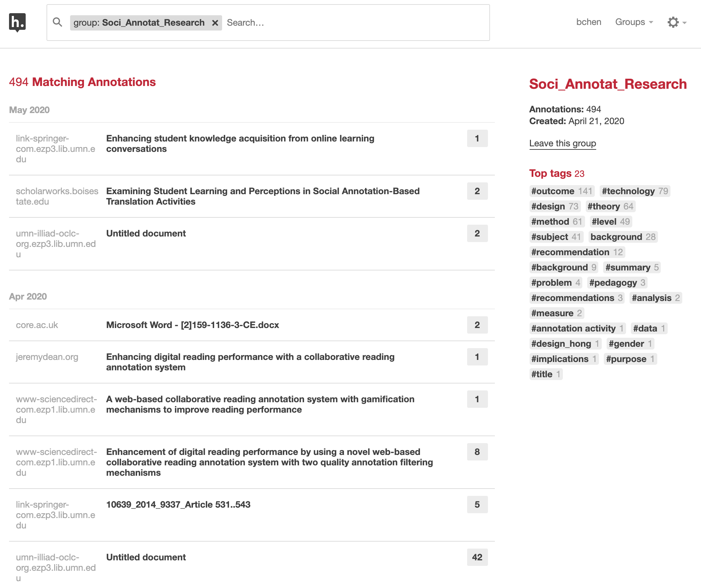
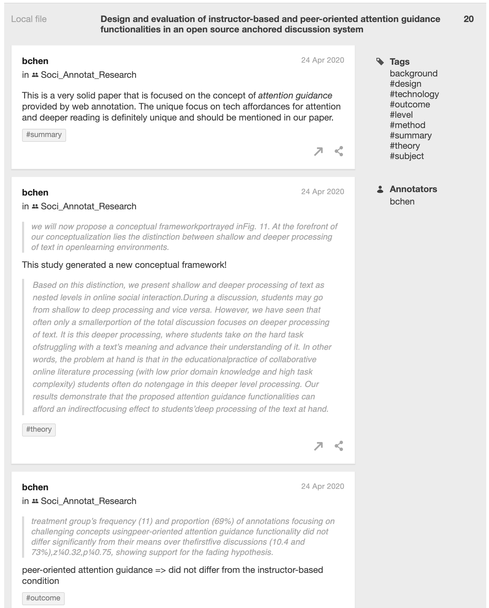
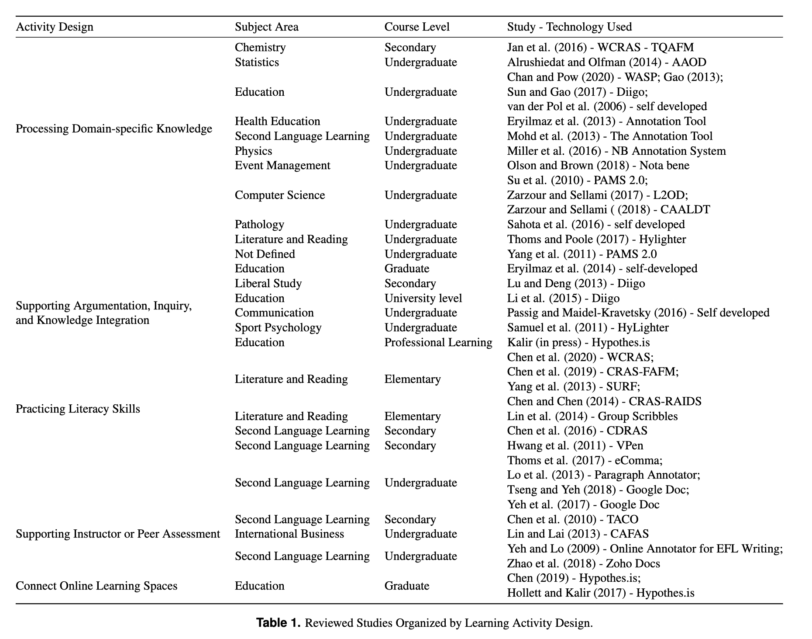

In response to [a special call for papers](https://www.emeraldgrouppublishing.com/journal/ils/evidence-based-and-pragmatic-online-teaching-and-learning-approaches) from *[Information and Learning Sciences](https://www.emeraldgrouppublishing.com/journal/ils?distinct_id=171f281115d5e4-01c33f74c6e464-30677c00-1ea000-171f281115e4ea)*, a team of us rallied and wrote a review article about **Using Social Annotation in Online Classes** ([see preprint](https://edarxiv.org/2nmxp/)). It was an interesting challenge given the short timeframe. But we eventually pulled this off as a team thanks to [Xinran Zhu](https://twitter.com/xinranz1?lang=en)'s strong leadership and everyone's dedication to this work. 

In this blog post, I won't talk about *what* we wrote. (You can read the preprint if you are interested.) __Instead, I will talk about *how* we used social annotation to conduct this collaborative literature review about social annotation.__ My hope is to share our collaborative research practice based on social annotation to those who're interested. 

# What is web annotation?

My interest in *web annotation* technologies dates back to my early PhD coursework. In 2010 (exactly 10 years ago), I took a course titled *Knowledge Media and Learning* offered by Prof Jim Slotta. My colleague [Cresencia Fong](https://ca.linkedin.com/in/cresencia-fong-phd-7a9a66b) and I became interested in "layered information systems" (probably coined by us) and led the class to explore this genre of knowledge media and a tool named [Diigo](https://www.diigo.com/). This work eventually informed my dissertation research on the [*Promising Ideas tool and promisingness judgments*](https://www.researchgate.net/project/Promisingness-Judgements-in-Knowledge-Building) in knowledge-building communities. 

**What is web annotation exactly?**

In 2017, the W3C Web Annotation Working Group published the [W3C Web Annotation Data Model](https://www.w3.org/TR/annotation-model/). As a technical recommendation, this document thinks about _annotation_ very broadly:

> Annotating, the act of creating associations between distinct pieces of information, is a pervasive activity online in many guises. Web citizens make comments about online resources using either tools built in to the hosting website, external web services, or the functionality of an annotation client. Comments about shared photos or videos, reviews of products, or even social network mentions of web resources could all be considered as annotations. In addition, there are a plethora of "sticky note" systems and stand-alone multimedia annotation systems.

This document further offers several basic principles to help us think about web annotation. It writes:

> An *annotation* is a rooted, directed graph that represents a relationship between resources (see the figure below). 
> 
> There are two primary types of resource that participate in this relationship, Bodies and Targets.

I like this basic technical definition because it articulates the boundary of a web annotation while focusing on the *relationships* and *associations* between web objects an annotation involves.

To me, **the crucial, definitive characteristic of web annotation is an active, retrievable link between the annotation body and the annotated target**. Web annotation is fundamentally about the user generating one piece of information and linking it with a pre-existing piece of information on the web. 

**Isn't this what we do all the time as academic researchers?** In the following figure created by the  Open Science Framework (OSF) to depict the entire research lifecycle, it appears each stage is about processing existing information and transform it into new information (e.g., from literature to a research idea, from interview data to codes). **One main challenge with the research lifecycle, however, is we do not have a good approach to maintain these links between different types of information.**

# Using web annotation for collaborative literature review

When conducting this literature review, we used web annotation as an important strategy to maintain the linkages between our analysis/interpretation and the literature we analyzed. Five of us collaborated on this project. So we also used web annotation to link us as collaborators.

The collaborative work roughly involved two stages: *initial coding*, and *theme development*. We used a web annotation tool named **[Hypothesis](https://hypothes.is/)** in both stages. Below, I describe how Hypothesis was integrated in our collaborative research workflow.

## Initial coding stage

After a systematic literature search and screening, we narrowed our scope down to ~40 research articles. It's a reasonable size for a typical literature review and we had a lot to process within a short timeframe. 

After deciding to use Hypothesis, **we created a private group** for this work.

After a few Zoom meetings, **we came up with a few key dimensions that would be used to consistently code all articles**. In particular, we agreed that for each article, we would code its content related to "level of education," "subject area," "technology," "activity design," "research methods," and "learning outcomes" using their corresponding tags. For each article, **the lead researcher would also create a *page note* to summarize key take-aways** from this article. 

In total, we generated 494 annotations about ~40 articles. Below is a screenshot of our group page.

Importantly, our Hypothesis annotations were created within the context of each article, and the **relationships** between our codes and the original content were preserved. For each article, the annotations are both summarized on the group page and remain embedded in the annotated document. 

## Theme development stage

After the initial coding, the next challenge for the team was to distill a couple themes to synthesize our findings and make them useful for the reader. 

To this end, **each of us first reviewed all annotations made by the group** and replied to each other when there was a question or suggestion about a particular annotation. 

**We used the native Hypothesis interface to filter our annotations by tags**. For example, clicking on tag `#design` would help us quickly retrieve information about every study's activity design. 

**We also used a tool named [Facet](https://jonudell.info/h/facet/)** that was developed by Jon Udell. With Facet, we could not only review and filter our annotations, but also download them into different formats (e.g., CSV, JSON). 

After several Zoom meetings and writing sprints, **we synthesized our findings into five themes** that are reported in [the manuscript](https://edarxiv.org/2nmxp/) (see the table below). During the write-up, I went back to read specific annotations, drawing on our annotations as a database of ideas. 

# How is web annotation useful for a literature review project like this?

There are designers like [Andy Matuschak](https://andymatuschak.org/) who are thinking deeply about tools for thought and for knowledge work. A pity we academics do not spend enough time to think about our knowledge work. Rumors are that some of us are still using a giant Word document to keep references. 

**To me, tools I use as a researcher are my extended brain and carry out important cognitive work for/with me.** It would also be ideal if tools I use also embody my philosophies.

With these high-level ideas in mind, web annotation is useful for me in a number of ways.

**First, from both the UI and the technical implementation, web annotation cares about relationships and links and tries to keep them alive.** In this case, it kept my reaction to a piece of information in an article anchored in the exact place where my reaction occurred. I can choose to go back to the location where an annotation was created (assuming the file is not corrupted). 

**Second, web annotation enhances within-group accountability.** Within the team, we made our thinking visible to each other by explicitly anchoring our ideas in the analyzed articles. Without the step of socially annotating these articles, we would probably directly write notes in a Google doc, with the links between our ideas and the analyzed literature largely obscure and inconsistently maintained. Being able to see and respond to each other's initial annotations had two effects: 1) it made the annotator more accountable when annotating, as these annotations were not only for herself but for the team; and 2) we did challenge each other's annotations, which lead to greater inter-rater reliability. 

**Third, web annotation enhanced research transparency and reproducibility.** The fact we can go back to check our initial coding at any point makes our (qualitative) work much more reproducible. We could even include our annotations in the submission if a journal demands it. 

**Finally, using web annotation is fun.** I appreciated so much of everyone's thinking. It made literature reading more social and less like a solo sport. Here, I'd like to thank all team members, Xinran Zhu, Rukmini Manasa, Hong Shui, and Raymond Zhang, who shared this journey with me.