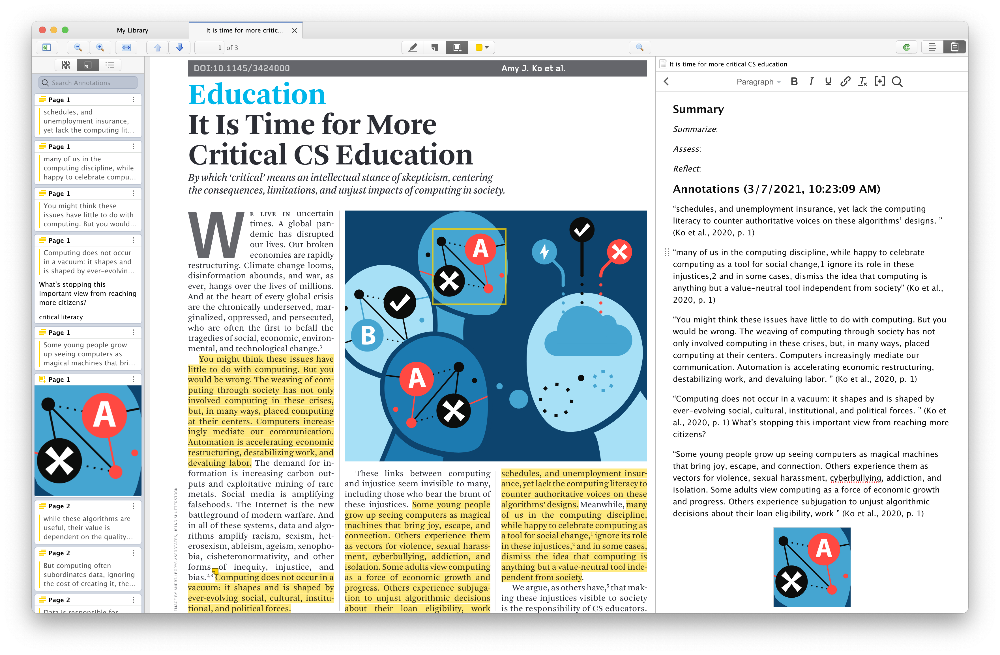

Over the years, I have been interested in *scholarly workflows* and, more recently, *knowledge infrastructures* -- for both knowledge workers and young learners. 

It has become a hobby for myself to reflect on my own workflows and explore tools that I could add to improve my scholarly practice. I was interested enough in this topic to give [a talk on this topic](https://bodong.me/talk/2020-07-bnu/) (in Mandarin) last summer. 

## Annotation software as knowledge infrastructure

*Annotation* is, and has always been, an important part of knowledge processes. 

I have been a heavy annotator since I learned to take notes as an elementary student. My high-school textbooks are covered with excessive marginalia. That's where ideas from the textbook, my teachers, and myself interacted. I somehow never liked taking notes in a separate notebook because I relied too much on the note-taking contexts and connections. (Of course, as a student my learning at that time was very much focused on textbooks.)

As a researcher now, I still tend to heavily annotate papers that interest me, using a web annotation tool named *[Hypothesis](https://hypothes.is/)*. 

No matter which tools are used, to me annotation is an important "move" in my scholarly workflow. It allows me to engage with the reading, connect with ideas I'm currently coping with, and reframe the content in relation to ideas in my mind. For a researcher, annotation tools -- when designed and used well -- provide an important *knowledge infrastructure* that integrates reading and writing, spurs the creation of new ideas, and supports peer dialogues. 

Unfortunately, many tools attempt to lock annotations within their own systems. This is understandable as many tool developers have reasons to maximize user engagement with their tools. As a result, researchers either need to do a great deal of manual work to piece together a workable workflow, or simply never attempt to fix their "disconnected" workflows. Time spent on reflecting on and tweaking our workflows is not explicitly rewarded, until you suddenly realize the benefits of doing so. 

Zooming out to consider critiques on scholarly work in academia -- research transparency, peer review, and training of future-generation scholars -- **web annotation technologies have matured to offer opportunities for anchored dialogues, portable & interoperable knowledge artifacts, open data, etc. What's missing is a concerted effort to envision new social, cultural, political, and technical configurations to improve the larger system.** I believe this effort should not be led (only) by players with the most resources but be re-centered on the actual work and humans doing the work. 

## Annotation in Zotero

That's a long way to say I welcome [Zotero's recent experiment with a build-in annotation facility](https://www.zotero.org/support/pdf_reader_preview) based on the open-source pdf.js library. It's still in *beta* so treat it as work-in-progress. 

After trying it myself, I found it already quite well designed. It provides an annotating experience that's quite close to Hypothesis (which also integrates pdf.js). You can highlight, annotate, tag an annotation, add sticky notes, etc. What's nice about the tagging system is it's essentially the same as the Zotero library, allowing you to connect paper-level tags with tags made at the annotation level. 

It even allows you to screen-capture in a paper -- a feature not available in Hypothesis yet. 

What's also nice is that you can create a paper-level summary with these annotations (see screensho below). In this summary, you can add paper-level commentaries. Within the created summary, you can also click on a "Show on Page" button of each imported annotation to go back to the original location of the annotation. 

After twenty minutes spent on the beta annotation tool, I find it already quite useful. Meanwhile, I also have a few suggestions:

- First, can the summary page be exportable? A summary can be currently "exported" by copy-and-paste. 
- Second, can individual annotations be more retrievable? They can now accessed within the summary panel. Can annotations be made discoverable, referenceable, and citeable in other places -- such as the summary of another paper? 

Overall, it's exciting to see this new addition to Zotero -- a long-standing open-source tool that has benefited many, and I look forward to further improvements from the project team.  
