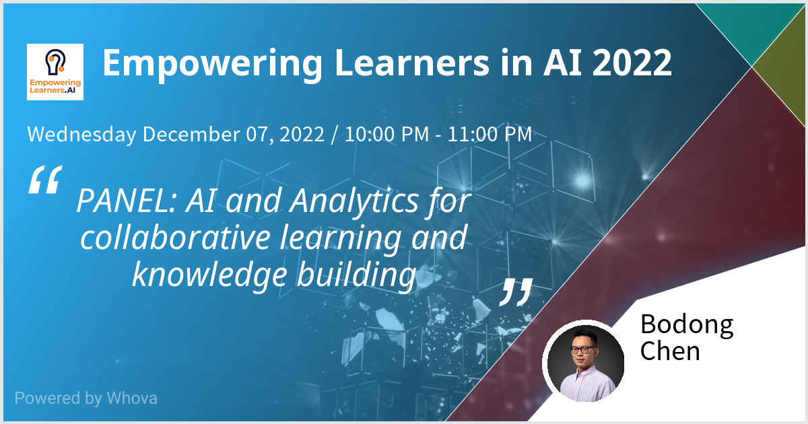

Earlier this week, I had the good fortune of joining a panel organized by my colleageus Seng Chee Tan and⁩ Alwyn Lee at the [2022 Empowering Learners in AI conference](https://empoweringlearners.ai/). Several colleagues including Leanne Ma (University of Tornoto), Chew Lee Teo (National Institute of Education in Singapore), and Mutlu Cukurova (University College London) were also on the panel.

While my colleagues on the panel presented some really exciting new research, I used my time to ask a series of questions. My "slides" can be found on [natto.dev](https://natto.dev/@chen/876e1c02b7014663b153d031a537b591?layout=fykdf9qm). 

In this post, I'd like to elaborate on a few key points from that talk.

<!--  -->

---

*Generative AI* applications such as GPT-3, DALL-E, and Github Copilot are powerful and playful. And they are here to stay.

Like many, my social media feeds (in both English and Chinese) are recently flooded with posts about ChatGPT, just a few months after being flooded by artworks co-generated with DALL-E. While there is less public discusison of [Github Copilot](https://github.com/features/copilot) as it's tailored to programmers, Copilot is making its way into podcasts, debates, and [law suits](https://www.infoworld.com/article/3679748/github-faces-lawsuit-over-copilot-coding-tool.html).

I've been playing with GPT-3 in various contexts of my work and the panel offered me an opportunity to reflect on the interface between learning and generative AI. 

I situate this reflection on my extensive work on supporting *Knowledge Building* in schools, through both technology design and school partnerships. 

One key goal of Knowledge Building is to make sure students have a greater say about what they learn and how they learn it. Using fancier terms, Knowledge Building aims to turn over greater *epistemic agency* and *cognitive responsiblity* to students by structuring learning around problems and ideas students hope to pursue. 

While colleagues in the Knowledge Building community have done extensive R&D on technology and analytics, generative AI has yet to be integrated in the Knowledge Building infrastructure.

To me, for generative AI to do good -- rather than causing more harm -- we need to ask three important questions:

### 1. What is learning and how does it happen?

As a learning scientist, I'd be worried if too many efforts of integrating AI in education is guided by a narrow conception of learning. That's why I appreciate the word "empowering" in the conference title.

So for each AI use case, it is important to ask what learning is, how learning happens, what perspectives of learning are amplified or neglected, and whose perspectives are not represented. We need to discuss AI and analytics in relation to each specific conception of learning. 

For knowledge building, learning is supported by engaging students to continually improve their ideas. Students are not limited to acquiring a body of curricular ideas. They learn domain knowledge and basic skills, but also higher-order competencies such as finding/defining problems, collaborating as a collective, finding promising ideas, reflecting on emerging knowledge structures, making sense of analytics, etc. 

In this case, using AI for getting quick answers would take away important objectives of learning that involve uncertainties, setbacks, and human dialogues. 

This concern brings up the second question: 

### 2. How to properly position machine intelligence?

One hallmark of knowledge building is students assume high-level cognitive responsibility. They have great epistemic agency as knowledge building happens around their real ideas about authentic problems they identify.

Considering collaborative learning in general, Dr. Stephanie Teasley and I discussed in [our Learning Analytics Handbook chapter](https://www.solaresearch.org/publications/hla-22/hla22-chapter9/) about the dimensions of analytics as partners vs. regulators, and being loosely vs. tightly coupled with learning processes. 

In [his keynote](https://whova.com/portal/webapp/empow_202212/Agenda/2733311) at the Empowering Learners in AI conference, Dr. Chris Dede made a convincing argument for using AI to augment human intelligence, especially in areas involving "human judgment, applied wisdom, and decision making." 

In the same vein, [Jeremy Roschelle, Pati Ruiz, and Judi Fusco wrote about AI or IA for education](https://cacm.acm.org/blogs/blog-cacm/251188-ai-or-intelligence-augmentation-for-education/fulltext) drawing on Douglas Engelbart, and arguing for "focus[ing] attention on how human and computational intelligence could come together for the benefit of learners." They also urged us to ground this work in ethics and equity, and balance "the new powers of computational intelligence ... by the wisdom of educators and students."

Emerging generative AI tools are tilting the balance of power that was mentioned by Roschelle and colleagues. These generative AI tools can seem to be so powerful, efficient, creative, and playful, even though [sometimes at the expense of accuracy](https://twitter.com/ReaderMeter/status/1599285703300743168). While the notion of augmentation is not new, properly positioning machine intelligence becomes a challenge that's now even bigger and more urgent, especially for education. 

A major design challenge for the integration of AI in knowledge building is: How can we properly position AI to augment student intelligence so that their epistemic agency can be retained and empowered?

### 3. What surrounding infrastructures need to change?

Generative AI tools like GPT-3 and Github Copilot are disrupting practice of assessment, such as [essay writing](https://doi.org/10.1007/s40593-022-00300-7) and [coding assignments](https://www.youtube.com/watch?v=uvNRE1o8ANE), leading many instructors to scramble for new tools for curbing plagiarism. But unfortunately it is questionable whether such an "arm race" will do anything good for education. 

Rather than continuing to build tools based on distrust, it is also important to ask how assessment paradigms need to evolve in the rapidly changing information ecologies.  

Technology integration in education is never purely technical. Technological advances need to be coupled with reconfiguration of educational practice. 

How can we continue to evolve educational knowledge infrastructures, using words from [Dr. Simon Buckingham Shum](https://simon.buckinghamshum.net/2019/08/la-as-edu-ki/), based on care, fairness, and trust?

One important part of puzzle, I believe, is to equip humans with new literacies. We need to consider a new era of personal computing with AI and to engage students to not only use off-the-shelf AI tools but to agenticly leverage new intelligences to augment their work.  

		
## Notes

- Chen, B., & Teasley, S. D. (2022). Learning analytics for understanding and supporting collaboration. In C. Lang, G. Siemens, A. F. Wise, D. Gašević, & A. Merceron (Eds.), *The handbook of learning analytics* (2nd ed., pp. 86–95). SoLAR. [https://www.solaresearch.org/publications/hla-22/hla22-chapter9/](https://www.solaresearch.org/publications/hla-22/hla22-chapter9/)

