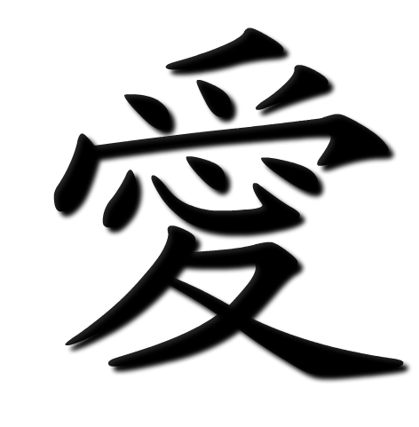

Consider the character for *love*: 愛 becomes 爱. In the traditional form, the *heart* (心) sits nestled within—love literally contains the heart. In the simplified version, that heart disappears. What remains is efficient, streamlined, easier to write and learn---helpful for boosting literacy rate. But something essential has been extracted from the very concept it represents.

Or take this example from linguist Li Chunyang's book about the "Vernacular Movement" in the early 1900s: the classical Chinese phrase "何省长昨日去岳麓山扫其母之墓" (Governor He went to Yuelu Mountain yesterday to sweep his mother's grave) becomes in vernacular "何省长昨日去岳麓山扫他妈的墓"—which can be read as Governor He going to "sweep his damn grave" due to the ambiguity of vernacular pronouns. What was once respectful and precise becomes potentially profane through linguistic simplification.

These moments in Chinese language evolution offer an interesting parallel to our current transition into the age of artificial intelligence. Both represent inflection points where efficiency and accessibility come at the cost of embedded knowledge—and where the very nature of human cognition (or even humanness) is fundamentally altered.

## The Great Forgetting, Albeit Democratization

When China transitioned from classical to vernacular Chinese in the early 20th century, it created a profound paradox: democratizing literacy while simultaneously severing connections to centuries of wisdom and social order. 

Classical Chinese could encode complex philosophical concepts in remarkably few characters, with layers of meaning that vernacular Chinese often requires paragraphs to convey. As classical literacy declined, an entire cognitive tradition became increasingly inaccessible.

The flip side of this "forgetting" is democratization of knowledge. As the vernacular form of writing got promoted, the classical Chinese elite gradually lost their gatekeeping power over knowledge (via classical written prose). The transition enabled new forms of expression and democratized literacy, reshaping fundamental aspects of identity and social hierarchy. 

This dual movement—democratization and loss—mirrors our current AI transition. Just as vernacular Chinese broke the scholarly elite's monopoly on written knowledge, AI is democratizing capabilities once requiring specialized expertise. Yet we risk losing the cognitive processes that created that knowledge in the first place. As AI handles more composition tasks, we may lose the iterative thinking that emerges through the struggle of writing itself. While we're fine with relying on GPS apps, as [Andy Clark](https://www.nature.com/articles/s41467-025-59906-9) points out, what makes these new forms of "forgetting" we are currently experiencing different?

One crucial difference lies in what can be recovered. Classical Chinese knowledge was preserved in texts and could theoretically be restored to some extent. But human cognitive patterns—how we develop intuition, make creative leaps, engage in deep reflection—are more ephemeral. Once these atrophy at a population level, they may prove much harder to reconstruct than any written tradition.

## Choosing What Endures

Our society have some choices to make: *Which cognitive capacities should we consciously preserve? How do we maintain the "heart" in our knowledge systems while embracing AI's efficiency?* 

Just as the simplified character for love lost its embedded heart, our cognitive relationship with knowledge risks becoming more efficient but less felt, less embodied, less integrated with human experience. The question isn't whether AI will change how we think—it already is. The question is whether we can be as deliberate about preservation as we are about adopiton and innovation.

Today, we face similar choices about human cognition as Chinese people debated language policies in the 20th century.[^1] We can delegate everything that AI can do better, or we can thoughtfully preserve the cognitive practices that make us most human—not because they're more efficient, but because they connect us to something essential about human experience and wisdom.

[^1]: Many have argued the Chinese language evolution has been hijacked by various political forces, leading to significant harms to the language and culture.

The character for love can still be written with its heart intact, even if most people now write the simplified form. Similarly, we can choose to maintain the cognitive practices that keep the heart in human knowledge, even as we embrace AI's remarkable capabilities.

The question is not whether we'll change, but whether we'll change with intention—preserving what makes us most human while negotiating new relationships with natural and artificial intelligence. Like all great transitions, this one will redefine what it means to be human. The choice is whether we shape that redefinition consciously or let it happen to us.
