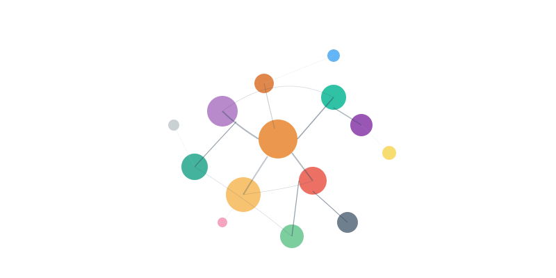

A quiet shift is happening in how we speak and write, and most of us don't even notice it. Words like "delve," "underscore," and "realm" are suddenly everywhere in academic writing and speech. "[You sound like ChatGPT](https://www.theverge.com/openai/686748/chatgpt-linguistic-impact-common-word-usage)," before you started to notice.

For example, Kobak et al. (2024) analyzed over 14 million PubMed abstracts from 2010-2024 and found certain words showed abrupt frequency increases following the release of ChatGPT. A more recent analysis of 280,000 YouTube videos showed a similar shift to reflect the AI's flavor.

But this isn't just about linguistic trends. It represents a fundamental threat to how humans learn and make meaning.

## The 'Heart' of Learning

Educational psychologist Merlin Wittrock identified something crucial about authentic learning half a century ago. He argued that genuine understanding occurs when learners create "**semantic and distinctive idiosyncratic associations between stimuli and stored information**" (Wittrock, 1974, p. 89). The word "idiosyncratic" isn't academic jargon—it's the key to **learning with understanding**.

When you truly understand something, you connect it to your unique knowledge, experiences, and ways of thinking. Your explanation of photosynthesis differs from mine because we bring different mental models, metaphors, and personal connections to the concept. This distinctiveness isn't a bug in the learning system—it's a feature.

Wittrock called this **generative learning** because learners actively generate their own meaningful connections rather than passively receiving information. Wittrock (1992) went on and presented a model of generative learning consisting of four major processes: (a) attention, (b) motivation, (c) knowledge and preconceptions, and (d) generation. The learner---and their idiosyncrasy---plays key roles in the processes of generating learning. 

The original idea of generative learning, grounded in the cognitive tradition, has been greatly expanded since then. With the advent of Web 2.0 and social media, the term generative learning also conveys the generation and iteration of external knowledge artifacts—wikis, shared documents, code repositories, and multimedia content that embody and extend human cognition beyond individual brains. This shift aligns with broader philosophical movements that challenge anthropocentric views of knowledge creation: such as work on object-centered sociality and actor-network theory that reveals how digital artifacts themselves possess agency in shaping learning processes. In this post-human understanding, generative learning becomes a distributed phenomenon where cognition is not contained within individual brains but emerges through entanglements between human intentions, algorithmic processes, platform affordances, and the material properties of digital objects themselves—transforming learning from a psychological process into an ecological one where knowledge generation occurs through the dynamic interactions between human and non-human actors in networked environments. 

Despite the expansion and shifts, what remains true, I believe, is that **human idiosyncrasy still matters for learning with understanding**. 

## The Homogenization Problem

But what happens when our language—the very medium through which we express these idiosyncratic connections—becomes standardized by algorithms?

Recent studies reveal the scope of this challenge. Multiple studies have described a "creep-in factor" where AI influences human language below our level of perception. An analysis of approximately 280,000 video transcriptions from over 20,000 academic YouTube channels found that following ChatGPT's release, word frequencies in human spoken communication began shifting toward AI-favored patterns (Yakura et al., 2025).

Human preferences are also implicated. Juzek and Ward (2025) investigated why large language models overuse certain words and found evidence that humans exhibit preferences for AI-favored vocabulary even when they don't realize it. Their research suggests that AI's linguistic patterns align with what we perceive as "high-quality" writing, creating a feedback loop where AI learns from human preferences and then influences those same preferences.

Recent neuroscience research offers another perspective to this concern. Kosmyna et al. (2025) used EEG to monitor brain activity while participants wrote essays using ChatGPT, Google search, or no tools. They found that ChatGPT users showed the lowest brain engagement and "consistently underperformed at neural, linguistic, and behavioral levels." The essays were described by evaluators as largely "soulless," lacking original thought and relying on similar expressions.

## The Educational Tension

This creates a profound dilemma for educators. How do we distinguish between a student's authentic understanding expressed in their own voice and AI-influenced expression using algorithmic language patterns? When students write about "delving into complex realms" and "underscoring pivotal insights," are they demonstrating genuine learning or unconsciously echoing AI's preferred vocabulary?

**The stakes are definitely higher than plagiarism detection.** If students lose their distinctive ways of expressing ideas, they may also lose the personal connections that make learning meaningful and transferable. Generative learning depends on learners creating their own semantic associations or creating knowledge artifacts that reflect who they're—but if everyone's associations or production (if any) start sounding the same, something essential is lost.

Consider a student explaining climate change. An authentic response might draw on their experiences with local weather patterns, their concerns about their hometown's future, or connections to their family's farming background. An AI-influenced response might "delve into the multifaceted complexities of this pivotal challenge" without revealing any personal meaning-making.

Educators should not be dealing with this tension alone. Tool developers need to take additional responsibility. Current AI models are trained to produce text that humans perceive as high-quality, which often means formal, polished, or sometimes flattery language. This creates a feedback loop where AI learns to mimic elevated language, humans unconsciously adopt these patterns, and the cycle continues. This feature of LLMs now becomes a bug for our society.
## Preserving Human Meaning-Making: Open Questions

This challenge raises fundamental questions that educators and developers urgently need to address. 

The question becomes: How do we design AI tools that enhance human expression rather than homogenize it? How do we preserve what the "idiosyncratic" nature of learning while leveraging AI's capabilities?

How can we better value the "idiosyncratic-ness" of student expression as an indicator of authentic learning? What interventions help students maintain their distinctive voice while working with AI tools? Can we design AI interactions that enhance rather than homogenize student expression? How do we preserve cognitive diversity in an age of algorithmic standardization?

Perhaps most fundamentally: As AI becomes more sophisticated at mimicking human expression, how do we ensure that humans don't lose what makes their learning uniquely human—the ability to create distinctive, personal, and meaningful connections to knowledge?

The future of education may depend on how we answer these questions. 

## Authorship Statement

The blog post was written with the help of Claude but thoroughly edited by me.

## References

Yakura, H., Lopez-Lopez, E., Brinkmann, L., Serna, I., Gupta, P., Soraperra, I., & Rahwan, I. (2025). _Empirical evidence of Large Language Model’s influence on human spoken communication_ (No. arXiv:2409.01754). arXiv. [https://doi.org/10.48550/arXiv.2409.01754](https://doi.org/10.48550/arXiv.2409.01754)

Juzek, T. S., & Ward, Z. B. (2025). Why Does ChatGPT “Delve” So Much? Exploring the Sources of Lexical Overrepresentation in Large Language Models. In O. Rambow, L. Wanner, M. Apidianaki, H. Al-Khalifa, B. D. Eugenio, & S. Schockaert (Eds.), _Proceedings of the 31st International Conference on Computational Linguistics_ (pp. 6397–6411). Association for Computational Linguistics. [https://aclanthology.org/2025.coling-main.426/](https://aclanthology.org/2025.coling-main.426/)

Kobak, D., González-Márquez, R., Horvát, E.-Á., & Lause, J. (2025). _Delving into ChatGPT usage in academic writing through excess vocabulary_ (No. arXiv:2406.07016). arXiv. [https://doi.org/10.48550/arXiv.2406.07016](https://doi.org/10.48550/arXiv.2406.07016)

Kosmyna, N., Hauptmann, E., Yuan, Y. T., Situ, J., Liao, X.-H., Beresnitzky, A. V., Braunstein, I., & Maes, P. (2025). _Your Brain on ChatGPT: Accumulation of Cognitive Debt when Using an AI Assistant for Essay Writing Task_ (No. arXiv:2506.08872; Version 1). arXiv. [https://doi.org/10.48550/arXiv.2506.08872](https://doi.org/10.48550/arXiv.2506.08872)

Wittrock, M. C. (1974). Learning as a generative process. *Educational Psychologist*, 11(2), 87-95.  [https://doi.org/10.1080/00461527409529129](https://psycnet.apa.org/doi/10.1080/00461527409529129)

Wittrock, M. C. (1992). Generative Learning Processes of the Brain. _Educational Psychologist_, _27_(4), 531–541. [https://doi.org/10.1207/s15326985ep2704_8](https://doi.org/10.1207/s15326985ep2704_8)