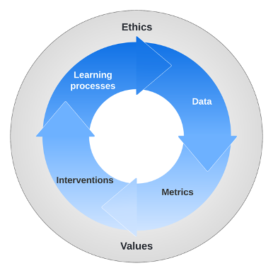

**Keywords**: network analysis, networked learning, social network analysis, learning analytics, network science, editorial

### ABSTRACT

Network analysis has contributed to the emergence of learning analytics. In this editorial, we briefly introduce network science as a field and situate it within learning analytics. Drawing on the Learning Analytics Cycle, we highlight that effective application of network science methods in learning analytics involves critical considerations of learning processes, data, methods and metrics, and interventions, as well as ethics and value systems surrounding these areas. Careful work must meaningfully situate network methods and interventions within the theoretical assumptions explaining learning, as well as within pedagogical and technological factors shaping learning processes. The five empirical papers in the special section demonstrate diverse applications of network analysis, and the invited commentaries from cognitive network science and physics education research further discuss potential synergies between learning analytics and other sister fields with a shared interest in leveraging network science. We conclude by discussing opportunities to strengthen the rigour of network-based learning analytics projects, expand current work into nascent areas, and achieve more impact by holistically addressing the full cycle of learning analytics.

