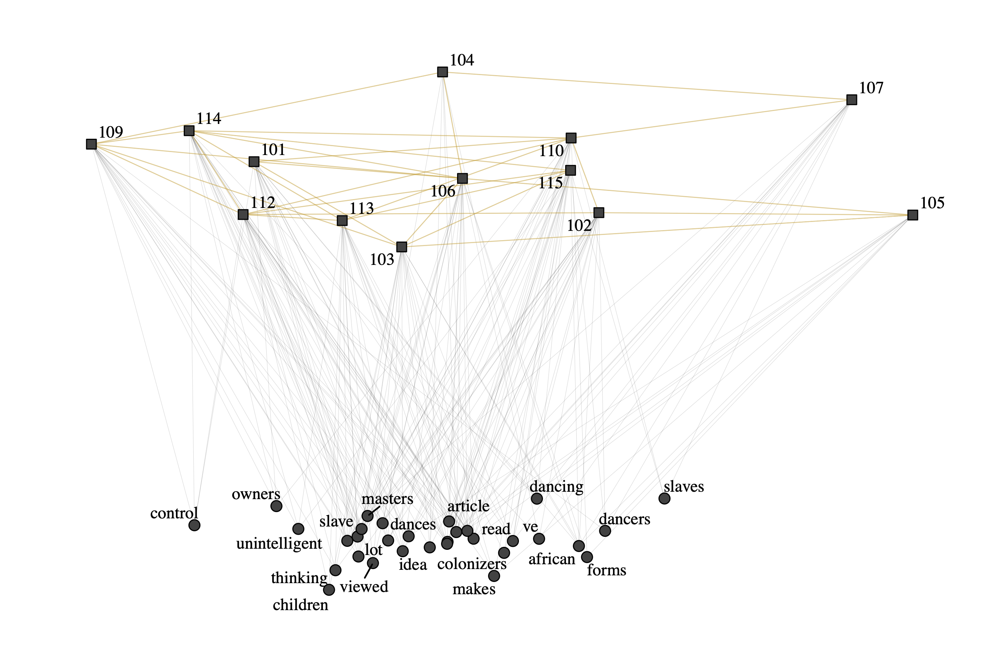

### ABSTRACT

Effective collaborative discourse requires both cognitive and social engagement of students. To investigate complex socio-cognitive dynamics in collaborative discourse, this paper proposes to model collaborative discourse as a socio-semantic network (SSN) and then use network motifs – defined as recurring, significant subgraphs – to characterize the network and hence the discourse. To demonstrate the utility of our SSN motifs framework, we applied it to a sample dataset. While more work needs to be done, the SSN motifs framework shows promise as a novel, theoretically informed approach to discourse analysis.

